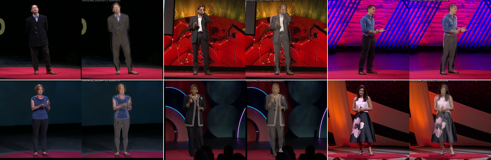

<p align="center">
  <h1 align="center">HolisticTracker</h1>
</p>

<div align="center">
  
</div>

## Introduction

HolisticTracker is a 3-stage expressive human body tracking pipeline that estimates **SMPL-X + FLAME** mesh parameters from monocular video. It was developed for building the [TEDWB1k](https://huggingface.co/datasets/initialneil/TEDWB1k) dataset and training [HolisticAvatar](https://github.com/initialneil/HolisticAvatar).

The pipeline adopts the **Expressive Human Model (EHM)** representation from [GUAVA](https://github.com/Pixel-Talk/GUAVA), which jointly optimizes SMPL-X body and FLAME head parameters in a unified mesh. The tracker extends this with multi-stage optimization and temporal smoothness for robust video-level tracking.

### Pipeline Stages

1. **Track Base** (`infer_ehmx_track_base.py`): Per-frame perception — body bbox, [Sapiens](https://github.com/facebookresearch/sapiens) 1B 133-keypoint detection, [HaMeR](https://github.com/geopavlakos/hamer) for per-hand MANO regression, MediaPipe FaceMesh for 478-point face landmarks, plus 70 / 203-point face landmark models. SMPL-X is initialized with [PIXIE](https://pixie.is.tue.mpg.de/) and face / hand crops are computed from the keypoints.
2. **FLAME Refinement** (`infer_ehmx_flame.py`): Refines head / jaw / expression / eye / eyelid parameters using FLAME-specific landmarks and [pixel3dmm](https://github.com/SimonGiebenhain/pixel3dmm) for dense face alignment.
3. **SMPL-X Optimization** (`infer_ehmx_smplx.py`): Joint optimization of full-body SMPL-X parameters (body, hands, expression) with per-frame and temporal losses, consistent with the FLAME face fit.

### Features

- Joint SMPL-X + FLAME body model (EHM) with hand/head scale optimization
- Sapiens-based face and body landmark detection
- PIXIE body estimation for robust initialization
- Per-shot temporal smoothness regularization
- Multi-GPU parallel processing with configurable workers per GPU
- Dataset merging with train/val/test split support

## Setup

Tested on Ubuntu 20.04 with CUDA 11.8+ and Python 3.10+.

```bash
git clone https://github.com/initialneil/HolisticTracker.git
cd HolisticTracker

conda create -n holistic_tracker python=3.10
conda activate holistic_tracker

pip install -r requirements.txt
pip install "git+https://github.com/facebookresearch/pytorch3d.git@v0.7.7"
```

## Model Preparation

### Parametric Models

Place body model files under `data/body_models/`:
- **SMPL-X**: Download `SMPLX_NEUTRAL_2020.npz` from [SMPL-X](https://smpl-x.is.tue.mpg.de/download.php)
- **FLAME**: Download `generic_model.pkl` from [FLAME2020](https://flame.is.tue.mpg.de/download.php)

### Pretrained Weights

Download the [pretrained weights](https://drive.google.com/file/d/1g_4YKQvLSWo8yzYHgNstr91RCD4rne8p/view?usp=sharing) and extract to `pretrained/`.

## Usage

### Single Video Tracking

```bash
export PYTHONPATH='.'
python tracking_video.py \
    --in_root /path/to/videos \
    --output_dir /path/to/output \
    --save_vis_video --save_images \
    --body_estimator_type pixie \
    --check_hand_score 0.0 -n 1 -v 0
```

### Parallel Processing (Multi-GPU)

```bash
export PYTHONPATH='.'
python infer_ehmx_parallel.py \
    --video_root /path/to/videos \
    --output_dir /path/to/output \
    --distribute 0,1,2,3,4,5,6,7 \
    --workers_per_gpu 2 \
    --body_estimator_type pixie
```

### Building a Training Dataset

After tracking, merge results into a training-ready format:

```bash
python merge_ehmx_dataset.py \
    --dataset_dir /path/to/tracked_output \
    --test_list /path/to/test.txt \
    --images_dir /path/to/source_images \
    --mattes_dir /path/to/alpha_mattes
```

This produces `optim_tracking_ehm.pkl`, `id_share_params.pkl`, `videos_info.json`, `dataset_frames.json`, and `extra_info.json` for use with HolisticAvatar's `TrackedData` loader.

## License

This project is released under the [MIT License](LICENSE).
